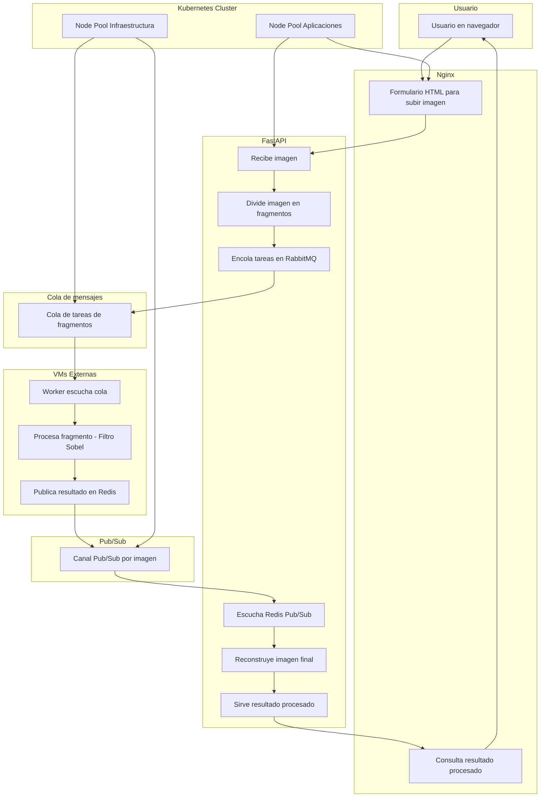
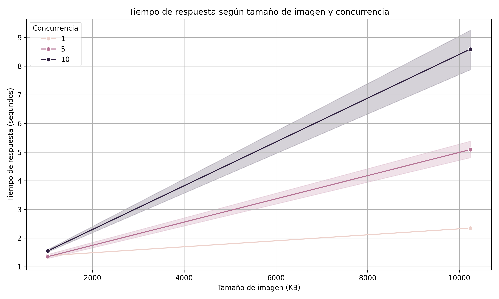

# 📋 README para Hit3

# 📚 Tabla de Contenidos

- [Objetivo General](#objetivo-general)
- [Deploy](#deploy)
- [Estructura del Repositorio](#estructura-del-repositorio)
- [Diseño de Arquitectura](#diseño-de-arquitectura)
- [Backend](#backend)
- [Worker](#worker)
- [Frontend](#frontend)
- [Comunicacion Distribuida: RabbitMQ y Redis](#comunicacion-distribuida-rabbitmq-y-redis)
- [Contenerizacion de Servicios con Docker](#contenarizacion-de-servicios-con-docker)
- [Orquestacion con Kubernetes](#️-orquestacion-con-kubernetes)
- [Infraestructura como Codigo (IaC) con Terraform](#️-infraestructura-como-codigo-iac-con-terraform)
- [Automatizacion de Despliegue](#automatizacion-de-despliegue)
- [Pruebas de Rendimiento](#pruebas-de-rendimiento)
- [Resultados y Conclusiones](#resultados-y-conclusiones)
- [Health Check y Logs](#health-check-y-logs)
- [Escalabilidad](#escalabilidad)


## Objetivo General

El presente proyecto tiene como objetivo diseñar y desplegar una plataforma distribuida para el procesamiento de imágenes mediante el filtro de Sobel, basada en tecnologías de contenedores y orquestada en un entorno cloud escalable.

A diferencia de soluciones anteriores de clústeres locales, en este caso se implementa una infraestructura en la nube utilizando Google Kubernetes Engine (GKE) como base, siguiendo las siguientes directrices:

1. Despliegue de clúster Kubernetes mediante Terraform, automatizando la provisión de:

- Un node pool específico para alojar servicios de infraestructura como RabbitMQ (sistema de colas) y Redis (sistema de notificaciones).

- Un node pool destinado a las aplicaciones del sistema: frontend, backend, workers de procesamiento.

2. Separación de procesamiento intensivo: los procesos de cómputo pesado (aplicación del filtro Sobel) son ejecutados en máquinas virtuales externas al clúster de Kubernetes, permitiendo un escalado independiente y optimizado.

3. Automatización de despliegues: construcción de pipelines que incluyen:

- Pipeline 1: Creación del clúster Kubernetes.

- Pipeline 1.1: Despliegue de servicios de infraestructura (RabbitMQ y Redis).

- Pipeline 1.2 - 1.N: Despliegue individual de cada aplicación (frontend, backend, worker).

- Pipeline 2: Provisión de máquinas virtuales para workers, buscando escalabilidad dinámica.

4. Análisis de desempeño bajo carga: se realizan pruebas de benchmarking modificando:

- Tamaño de las imágenes procesadas.

- Nivel de concurrencia de peticiones.

- Cantidad de workers disponibles.

Los resultados obtenidos permiten evaluar la escalabilidad, eficiencia y capacidad de respuesta del sistema ante diferentes condiciones de uso.

## Deploy

Para poder correr el proyecto:

```bash
  make deploy
  .\deploy_all.ps1
```

Para finalizar y liberar recursos:

```bash
  make destroy
```

## Estructura del Repositorio

La estructura de carpetas del proyecto es la siguiente:

```bash

/Hit3/
├── backend/                  # Servicio Backend (FastAPI) que coordina el procesamiento
│   ├── Dockerfile
│   ├── main.py
│   └── requirements.txt
│
├── frontend/                 # Interfaz web del usuario y servidor Nginx
│   ├── Dockerfile
│   ├── index.html
│   └── nginx.conf
│
├── worker/                   # Servicio Worker que aplica el filtro Sobel
│   ├── Dockerfile
│   ├── requirements.txt
│   └── worker.py
│
├── infra/                    # Infraestructura como código (Terraform)
│   ├── main.tf
│   ├── variables.tf
│   ├── outputs.tf
│   ├── terraform.tfvars
│   ├── terraform.tfstate
│   ├── .terraform/           # Archivos internos de Terraform
│   └── workers/              # Módulo específico para máquinas de procesamiento externo
│       ├── main.tf
│       ├── variables.tf
│       ├── terraform.tfvars
│       └── terraform.tfstate
│
├── k8s_actualizados/         # Manifiestos Kubernetes para despliegue de servicios
│   ├── backend-deployment.yaml
│   ├── backend-service.yaml
│   ├── backend-service-external.yaml
│   ├── frontend-deployment.yaml
│   ├── frontend-service.yaml
│   ├── nginx-deployment.yaml
│   ├── nginx-service.yaml
│   ├── rabbitmq-deployment.yaml
│   ├── rabbitmq-service.yaml
│   ├── redis-deployment.yaml
│   ├── redis-service.yaml
│   ├── worker-deployment.yaml
│   └── worker-hpa.yaml
│
├── test_images/              # Imágenes utilizadas para pruebas de benchmarking
│   ├── 1024KB.jpg
│   └── 10240KB.jpg
│
├── analisis_rendimiento_sobel.md   # Análisis del rendimiento obtenido
├── benchmark_results.csv           # Datos de benchmark
├── benchmark_result_plot.png       # Gráfico con resultados
├── generar_grafico_benchmark.py    # Script para generar el gráfico
├── deploy_all.ps1                  # Script de despliegue automatizado (PowerShell)
├── Makefile                        # Comandos útiles de automatización
├── test_sender.py                  # Script de pruebas de carga
├── test_benchmark.py               # Script de pruebas específicas
├── terraform.tfstate               # Estado de Terraform general
├── README.md                       # Documentación del proyecto
└── test.jpg                        # Imagen de prueba manual

```

## Diseño de Arquitectura

El sistema está compuesto por múltiples servicios distribuidos, organizados en una arquitectura asincrónica y escalable. El flujo principal de procesamiento es el siguiente:

```bash

[ Usuario ]
     |
     v
[ Frontend (Nginx + HTML) ]
     |
     v
[ Backend (FastAPI) ]
     |
     v
[ Divide Imagen + Encola tareas en RabbitMQ ]
     |
     v
[ Workers (en VMs externas) ]
     |
     v
[ Resultado parcial a Redis ]
     |
     v
[ Backend reconstruye imagen ]
     |
     v
[ Frontend muestra resultado final ]

```

Otros componentes del sistema:

- 🔁 RabbitMQ: cola de tareas de procesamiento.

- 📬 Redis: notificación de finalización mediante Pub/Sub.

- ☸️ Kubernetes (GKE): orquesta frontend, backend, Redis y RabbitMQ.

- 🖥️ VMs externas: ejecutan los workers fuera del clúster.





### Explicacion del Flujo

El flujo de trabajo comienza cuando el usuario sube una imagen a través del **Frontend**, una interfaz simple servida por Nginx.  
Esta imagen es enviada al **Backend**, que actúa como coordinador central del sistema.

El Backend divide la imagen en partes y encola cada tarea en **RabbitMQ**, permitiendo una distribución asincrónica del trabajo.  
Las tareas son consumidas por los **Workers**, que se ejecutan en **máquinas virtuales externas** al clúster de Kubernetes.  
Cada Worker aplica el **filtro de Sobel** a su porción asignada.

Una vez finalizado el procesamiento, cada Worker publica su resultado en **Redis** mediante un canal de *Pub/Sub*.  
Cuando el Backend detecta que todas las partes fueron procesadas, reconstruye la imagen completa.

Finalmente, el resultado es reenviado al Frontend, donde el usuario puede visualizar la imagen procesada.

Este diseño desacopla los componentes, favorece la paralelización y permite escalar horizontalmente tanto el procesamiento como los servicios.

## Backend

El Backend es el núcleo lógico del sistema. Está desarrollado en **Python** utilizando el framework **FastAPI**, lo cual permite definir servicios web de forma sencilla, robusta y con gran rendimiento asincrónico.

### 🎯 Funcionalidad principal

El Backend cumple múltiples roles:

- **Recepción de imágenes** desde el Frontend a través de un endpoint HTTP (`/upload`).
- **División de la imagen** en partes iguales, según la cantidad de Workers disponibles.
- **Encolado de tareas** en **RabbitMQ**, enviando un mensaje por cada porción de la imagen.
- **Escucha de Redis** por eventos de finalización, a través de **Pub/Sub**, para saber cuándo todos los Workers terminaron.
- **Reensamblado de la imagen final**, uniendo todas las partes procesadas por los Workers.
- **Envío del resultado** al Frontend mediante un endpoint (`/result/{image_id}`) que sirve la imagen procesada.

### 🔌 Endpoints expuestos

- `POST /upload`: Recibe una imagen original desde el usuario.
- `GET /result/{image_id}`: Devuelve la imagen ya procesada.

### 🔁 Comunicación

- **RabbitMQ**: se usa como cola de trabajo. Cada porción de imagen se publica como un mensaje con metadata (posición, tamaño, ID).
- **Redis**: se utiliza para la sincronización. Cada Worker publica en un canal indicando que completó su tarea. El Backend mantiene un contador por imagen y reconstruye el resultado una vez que llegan todas las partes.

### 🐳 Docker

El servicio está contenerizado mediante un **Dockerfile** que define:

- Imagen base: `python:3.10-slim`
- Instalación de dependencias vía `requirements.txt`
- Exposición del puerto 80 para FastAPI (con Uvicorn)

Esto permite su despliegue automatizado dentro del clúster de Kubernetes, facilitando escalabilidad y portabilidad.

### ☸️ Kubernetes

El Backend se despliega como un Deployment dentro de Kubernetes, acompañado de un Service para exponer el puerto internamente al clúster.  
En producción, puede ser accesible desde el Frontend vía nombre DNS interno (`http://backend`).

## Worker

El Worker es el componente encargado de aplicar el **filtro de Sobel** a una porción de la imagen. Este procesamiento es intensivo en CPU, por lo que los Workers se ejecutan en **máquinas virtuales externas al clúster de Kubernetes**, optimizando así la escalabilidad y rendimiento.

### 🧠 Funcionamiento

Cada Worker se conecta a **RabbitMQ** y queda a la espera de nuevos mensajes.  
Cuando recibe una tarea, realiza el siguiente proceso:

1. Decodifica la imagen (parte de la original) recibida como base64.
2. Aplica el **filtro de Sobel** en los ejes `x` e `y`, utilizando OpenCV.
3. Convierte el resultado en una imagen binaria (blanco y negro).
4. Codifica la imagen procesada nuevamente en base64.
5. Publica el resultado en **Redis**, en un canal que representa el ID de la imagen.

Este enfoque desacopla totalmente a los Workers del backend, permitiendo que se ejecuten en paralelo y en diferentes entornos.

### 📦 Detalles técnicos

- **Conexiones**:
  - `RabbitMQ`: escucha una cola llamada `image_queue` (o similar).
  - `Redis`: publica en un canal nombrado con el `image_id` correspondiente.
- **Tecnologías usadas**:
  - `opencv-python`: para el procesamiento de imagen.
  - `pika`: para conexión con RabbitMQ.
  - `redis-py`: para la conexión al servidor Redis.
  - `base64` y `numpy`: para manipulación y codificación de imágenes.

### 🐳 Docker

El `worker` está contenerizado mediante un `Dockerfile` que incluye:

- Imagen base de Python
- Instalación de dependencias desde `requirements.txt`
- Ejecución del archivo `worker.py` al iniciar el contenedor

### ☁️ Despliegue en VMs

En lugar de desplegar los Workers dentro del clúster de Kubernetes, se utilizan **máquinas virtuales** externas (provisionadas con Terraform) que permiten:

- Asignar más CPU y memoria específicamente para procesamiento.
- Escalar horizontalmente según demanda, sin saturar el clúster principal.

Este diseño cumple el objetivo de delegar el procesamiento pesado fuera del entorno orquestado, manteniendo alta eficiencia y paralelismo.

## Frontend

El Frontend es la interfaz mediante la cual el usuario interactúa con la plataforma.  
Su función principal es permitir la **subida de imágenes** y mostrar los **resultados procesados** luego de aplicar el filtro de Sobel.

### 🧱 Componentes

- `index.html`: contiene un formulario simple para subir una imagen vía `POST`, y una sección que muestra la imagen procesada una vez disponible.
- `nginx.conf`: configuración del servidor web que expone el frontend. Redirige internamente los pedidos hacia el Backend cuando es necesario.
- `Dockerfile`: imagen de Nginx que sirve los archivos estáticos (HTML) y la configuración personalizada.

### 🔌 Flujo

1. El usuario accede a la interfaz web.
2. Selecciona una imagen y la sube a través del formulario.
3. La imagen se envía al endpoint `/upload` del Backend.
4. El Frontend consulta periódicamente si el resultado está disponible en `/result/{image_id}`.
5. Una vez listo, se muestra automáticamente la imagen procesada al usuario.

### 🐳 Docker

El Frontend está contenerizado usando una imagen base de **Nginx**, con la configuración y HTML copiados al directorio correcto:

- Se expone el puerto 80.
- Se utiliza una configuración custom (`nginx.conf`) para enrutar correctamente las peticiones hacia el Backend.

### ☸️ Kubernetes

El despliegue incluye:

- Un `Deployment` con una única réplica, dado que el tráfico esperado es bajo.
- Un `Service` interno para exponer el puerto 80 dentro del clúster.
- Puede conectarse al Backend por nombre DNS interno (`backend`).

Este diseño asegura un frontend liviano, desacoplado, fácilmente reemplazable o escalable si se requiere.

## Comunicacion Distribuida: RabbitMQ y Redis

Para coordinar el procesamiento distribuido de imágenes, el sistema se apoya en dos tecnologías de mensajería asincrónica:

- **RabbitMQ**: se utiliza como sistema de colas para distribuir las tareas entre los workers.
- **Redis (Pub/Sub)**: se usa para notificar al backend cuando cada worker termina su parte, permitiendo saber cuándo reconstruir la imagen final.

---

### 📨 RabbitMQ – Sistema de Colas

RabbitMQ permite desacoplar el envío de tareas del procesamiento.

- En el **Backend**:
  - Se establece una conexión con RabbitMQ y se publica un mensaje por cada fragmento de imagen generado.
  - Cada mensaje incluye:
    - Un ID global de imagen
    - El índice del fragmento
    - El total de fragmentos esperados
    - La imagen en base64

- En el **Worker**:
  - Se suscribe a una cola (por defecto: `image_queue`).
  - Cada vez que recibe un mensaje, procesa la imagen y luego publica el resultado en Redis.

Esta arquitectura permite que múltiples workers procesen tareas de forma paralela, sin necesidad de conocer el origen de la solicitud.

---

### 📢 Redis – Sistema de Notificación (Pub/Sub)

Redis se usa como mecanismo ligero de notificación:

- Cada **Worker**, al finalizar su tarea, publica el fragmento procesado en un canal Redis identificado por el ID de la imagen (`image_id`).
- El **Backend** mantiene una suscripción activa al canal de esa imagen.
- Cada vez que recibe un fragmento:
  - Lo almacena en un diccionario temporal.
  - Cuando se reciben todos los fragmentos, los une y guarda el resultado.

Este enfoque elimina la necesidad de polling y garantiza reactividad inmediata ante la finalización de los procesos.

---

### 🔁 Ventajas del esquema RabbitMQ + Redis

- 🔄 **Asincronismo** completo entre partes.
- ⚖️ **Balanceo automático de carga** entre Workers.
- 🚀 **Escalabilidad horizontal** sin afectar al Backend.
- 🔔 **Notificación inmediata** de tareas completadas.

Este esquema de comunicación distribuida permite que el sistema escale con eficiencia y mantenga baja latencia en entornos de alta concurrencia.

## Contenerización de Servicios con Docker

Todos los componentes del sistema (Backend, Frontend y Workers) están **empaquetados en contenedores Docker**, lo que facilita su despliegue, escalabilidad y portabilidad.

Cada servicio posee su propio `Dockerfile`, adaptado a sus necesidades específicas.

---

### 🛠 Backend

- **Imagen base**: `python:3.10-slim`
- **Acciones principales**:
  - Copiar el código fuente y `requirements.txt` al contenedor.
  - Instalar las dependencias de Python.
  - Ejecutar el servidor FastAPI usando Uvicorn en el puerto 80.

- **Exposición**: expone el puerto `80` para comunicación interna en Kubernetes.

Este diseño liviano asegura un backend rápido de inicializar y de bajo consumo de recursos.

---

### ⚙️ Worker

- **Imagen base**: `python:3.10-slim`
- **Acciones principales**:
  - Copiar el archivo `worker.py` y su `requirements.txt`.
  - Instalar librerías necesarias como OpenCV, Pika (RabbitMQ) y Redis.
  - Ejecutar el script `worker.py` al inicio del contenedor.

Aunque el Worker está preparado para ser contenerizado, en este proyecto se despliega sobre **máquinas virtuales externas**, no dentro del clúster Kubernetes.

---

### 🌐 Frontend

- **Imagen base**: `nginx:latest`
- **Acciones principales**:
  - Copiar el archivo `index.html` y configuración `nginx.conf` personalizada.
  - Servir archivos estáticos HTML y manejar la redirección de peticiones al Backend.

- **Exposición**: puerto `80` en Kubernetes.

El uso de Nginx proporciona alta eficiencia para servir contenidos estáticos y realizar configuraciones de proxy inverso si fueran necesarias.

---

### 🚀 Ventajas de la contenerización

- 📦 **Portabilidad**: cada servicio puede ejecutarse en cualquier infraestructura que soporte Docker.
- 🔁 **Reproducibilidad**: los ambientes de desarrollo, prueba y producción son consistentes.
- ☸️ **Compatibilidad nativa** con Kubernetes para orquestación y escalado.

La contenerización fue clave para lograr un despliegue rápido, modular y altamente escalable del sistema.

## ☸️ Orquestación con Kubernetes

La plataforma utiliza **Kubernetes** (GKE) como sistema de orquestación de contenedores, permitiendo administrar el ciclo de vida de las aplicaciones de forma automática y escalable.

Se definen distintos componentes Kubernetes para desplegar y gestionar cada servicio:

---

### 📦 Deployments

Los `Deployment` garantizan que siempre haya una cantidad deseada de pods ejecutándose.

- `backend-deployment.yaml`: despliega el servicio backend (FastAPI).
- `frontend-deployment.yaml`: despliega el servicio frontend (Nginx).
- `worker-deployment.yaml`: despliega el servicio Worker (aunque en este caso se usa principalmente para pruebas, ya que los workers reales corren en VMs externas).
- `rabbitmq-deployment.yaml`: despliega el servicio de colas RabbitMQ.
- `redis-deployment.yaml`: despliega el servicio de base de datos en memoria Redis.
- `nginx-deployment.yaml`: alternativa de despliegue de frontend usando configuración personalizada (si aplica).

---

### 🌐 Services

Los `Service` exponen los Pods para permitir la comunicación interna en el clúster.

- `backend-service.yaml`: Service ClusterIP para que el Frontend pueda alcanzar al Backend.
- `backend-service-external.yaml`: Service LoadBalancer para exponer el Backend al exterior (opcional o en pruebas).
- `frontend-service.yaml`: Service ClusterIP para exponer el Frontend internamente.
- `worker-service.yaml`: (si se desplegaran workers internos).
- `rabbitmq-service.yaml`: expone RabbitMQ para acceso interno.
- `redis-service.yaml`: expone Redis para acceso interno.

---

### 📈 Autoscaling (HPA)

Se configura un `HorizontalPodAutoscaler` (`worker-hpa.yaml`) para el `Deployment` de Workers.

- El HPA permite escalar automáticamente la cantidad de pods de Workers en base a la utilización de CPU.
- Esto asegura que el sistema se adapte a cargas variables de procesamiento sin intervención manual.

---

### 📋 Organización en Node Pools

Siguiendo la consigna del TP:

- Se utilizan **node pools separados** en GKE:
  - Un grupo de nodos para infraestructura (RabbitMQ, Redis).
  - Otro grupo de nodos para las aplicaciones (Frontend, Backend).

Además, los Workers reales corren sobre máquinas virtuales externas al clúster, manteniendo así el procesamiento intensivo separado de los servicios básicos.

---

### 🚀 Beneficios de usar Kubernetes

- 📈 **Escalabilidad automática** basada en carga.
- ♻️ **Alta disponibilidad** mediante replicación de pods.
- 🔄 **Actualizaciones seguras** a través de despliegues rolling.
- 🔒 **Aislamiento de servicios** usando redes internas del clúster.

La combinación de Kubernetes y GKE permite una plataforma robusta, flexible y lista para producción.

## Infraestructura como Codigo (IaC) con Terraform

Toda la infraestructura de este proyecto se define utilizando **Terraform**, permitiendo su despliegue automático, reproducible y versionado.

Terraform se encarga de provisionar:

- El clúster de Kubernetes en Google Kubernetes Engine (GKE).
- La red de comunicación (VPC y subredes).
- Las máquinas virtuales externas para el procesamiento intensivo de imágenes (Workers).

---

### 📋 Estructura de Terraform

- `infra/main.tf`: define los recursos principales (VPC, Subnet, GKE Cluster, Node Pools).
- `infra/variables.tf`: variables parametrizadas como proyecto, región, zona, etc.
- `infra/outputs.tf`: salidas útiles como la IP del clúster.
- `infra/terraform.tfvars`: valores específicos asignados a las variables.
- `infra/credentials/terraform-admin.json`: credenciales de servicio para autenticación en GCP.
- `infra/workers/main.tf`: módulo independiente que gestiona la creación de las VMs externas para Workers.

---

### 🛠 Recursos creados

- **VPC propia**: red privada para la comunicación segura entre servicios.
- **Subred**: rango de IPs dedicado al clúster y las VMs.
- **GKE Cluster**:
  - **Node Pool de Infraestructura**: hospeda Redis, RabbitMQ y servicios de soporte.
  - **Node Pool de Aplicaciones**: hospeda Backend, Frontend y servicios de negocio.
- **Instancias de Compute Engine**:
  - VMs específicas para ejecutar los Workers fuera del clúster.

---

### 🚀 Automatización de infraestructura

Mediante simples comandos Terraform:

```bash
cd infra/
terraform init
terraform apply -auto-approve
```

Se levanta toda la infraestructura necesaria para el funcionamiento del sistema. Además, los módulos están organizados de manera que se puede destruir (terraform destroy) y reconstruir la infraestructura fácilmente en cualquier momento.

## Automatizacion de Despliegue

Para simplificar las tareas de despliegue y ejecución del sistema, se implementaron diferentes mecanismos de automatización mediante scripts y archivos auxiliares.

Estos permiten levantar tanto la infraestructura como los servicios de forma rápida, consistente y reproducible.

---

### 📜 Scripts de automatización

- `deploy_all.ps1`: 
  - Script de PowerShell que automatiza el proceso de despliegue completo:
    - Aplica Terraform para crear la infraestructura.
    - Aplica los manifiestos Kubernetes (`kubectl apply`) para desplegar los servicios.
    - Facilita la puesta en marcha inicial sin intervención manual paso a paso.

- `Makefile`:
  - Define comandos útiles para operaciones frecuentes como:
    - Aplicar Terraform (`make infra`)
    - Aplicar manifiestos Kubernetes (`make k8s`)
    - Eliminar recursos (`make destroy`)
    - Otros atajos personalizados.
  - Permite ejecutar procesos con una sola línea de comando desde terminal.

---

## Pruebas de Rendimiento

Para evaluar el desempeño de la plataforma bajo diferentes condiciones de carga, se diseñaron y ejecutaron pruebas de benchmarking automáticas.

El objetivo fue analizar:

- 📏 El impacto del tamaño de las imágenes en el tiempo de procesamiento.
- 👥 El comportamiento frente a distintos niveles de concurrencia.
- 🔥 El efecto de la cantidad de workers disponibles en el rendimiento.

---

### 🧹 Scripts de prueba

- `test_sender.py`:
  - Script principal de benchmark.
  - Permite enviar múltiples imágenes al Backend de forma concurrente.
  - Variables configurables:
    - Tamaño de la imagen.
    - Nivel de concurrencia (cantidad de hilos simultáneos).

- `test_benchmark.py`:
  - Extiende las pruebas de `test_sender.py`.
  - Permite ejecutar tests de forma sistemática para múltiples combinaciones de tamaños de imágenes y niveles de concurrencia.
  - Automatiza la recolección de resultados para facilitar su posterior análisis.

---

### 📈 Recolección y Análisis de Datos

- Los resultados de las pruebas se guardan en `benchmark_results.csv`.
  - Cada fila incluye:
    - Estado de la respuesta HTTP.
    - Tiempo de procesamiento (elapsed time).
    - Tamaño de la imagen enviada (en KB).
    - Nivel de concurrencia utilizado.

- `generar_grafico_benchmark.py`:
  - Script que toma el CSV de resultados y genera un gráfico de dispersión (`benchmark_result_plot.png`).
  - El eje X representa el tamaño de la imagen, y el eje Y el tiempo de procesamiento.
  - Cada color o agrupación puede representar diferentes niveles de concurrencia.

---

### 📄 Análisis de Resultados

El análisis detallado se encuentra documentado en `analisis_rendimiento_sobel.md`, incluyendo:

- Comportamiento observado al variar el tamaño de imagen.
- Impacto de la concurrencia en la latencia.
- Escalabilidad del sistema según la cantidad de workers activos.

En general, los resultados muestran:

- Un crecimiento razonablemente lineal del tiempo de procesamiento a medida que aumenta el tamaño de imagen.
- Beneficios claros de escalar la cantidad de Workers para soportar niveles altos de concurrencia.
- Buen desempeño de la plataforma hasta cargas moderadas/altas, con oportunidades de optimización para cargas extremas.

---

### 📊 Ejemplo de Gráfico de Benchmark



Este tipo de análisis permite identificar cuellos de botella y validar la capacidad de escalabilidad de la solución implementada.


## Resultados y Conclusiones

Las pruebas de rendimiento realizadas permitieron evaluar la plataforma en diferentes condiciones de carga y medir su comportamiento en escenarios realistas.

---

### 🧪 Principales resultados observados

- 📏 **Tamaño de la imagen**:
  - El tiempo de procesamiento aumenta de forma proporcional al tamaño de la imagen enviada.
  - Para imágenes pequeñas (1KB a 10KB) el tiempo de respuesta es casi inmediato.
  - A partir de tamaños mayores (1MB o más) se observa una pendiente de crecimiento más marcada en el tiempo de procesamiento.

- 👥 **Nivel de concurrencia**:
  - Hasta niveles moderados de concurrencia, el sistema responde de manera eficiente.
  - En cargas altas, sin suficiente cantidad de workers, la latencia comienza a incrementarse significativamente.
  - La incorporación de más Workers reduce el tiempo de espera promedio.

- 🔥 **Cantidad de Workers**:
  - A mayor cantidad de Workers, mejor es el desempeño en escenarios de alta concurrencia.
  - La plataforma se beneficia claramente del escalado horizontal de Workers para cargas intensivas.

---

## Health Check y Logs

Cómo se manejan los logs.

Health de los servicios (si aplica).

## Escalabilidad

El diseño de la plataforma fue pensado para soportar cargas de trabajo variables y adaptarse automáticamente a las necesidades de procesamiento.

La **escalabilidad** se implementa en diferentes niveles:

---

### ☸️ Escalabilidad en Kubernetes

- **Horizontal Pod Autoscaler (HPA)**:
  - Se configuró un HPA (`worker-hpa.yaml`) para el `Deployment` de Workers.
  - El HPA ajusta automáticamente la cantidad de Pods de Workers según el uso de CPU.
  - Cuando la carga de procesamiento aumenta, Kubernetes lanza nuevos Pods de Worker para mantener la latencia baja.
  - Cuando la carga disminuye, Kubernetes elimina Pods sobrantes para ahorrar recursos.

---

### ☁️ Escalabilidad de Máquinas Virtuales Externas

- Los Workers principales corren sobre **máquinas virtuales** creadas fuera del clúster de Kubernetes.
- Esto permite:
  - Asignar más potencia de CPU y RAM específicamente para procesamiento intensivo.
  - Agregar o eliminar VMs manualmente (o mediante automatización futura) en función de la demanda.
- La arquitectura está preparada para escalar el número de VMs de forma horizontal, aumentando así la capacidad total del sistema.


