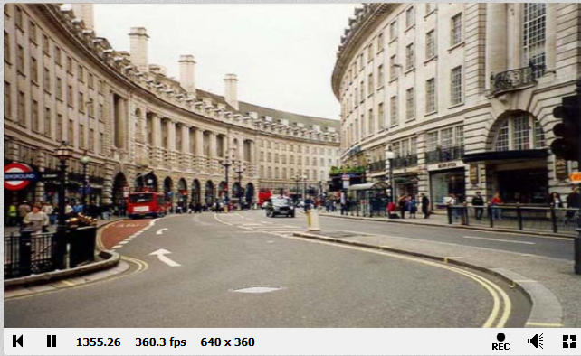
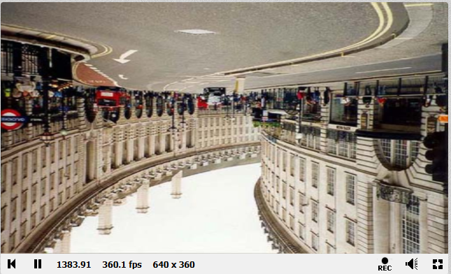
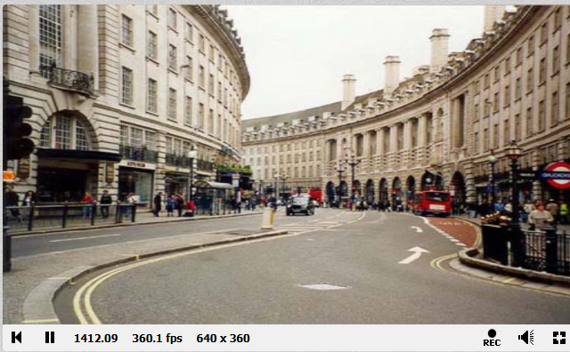
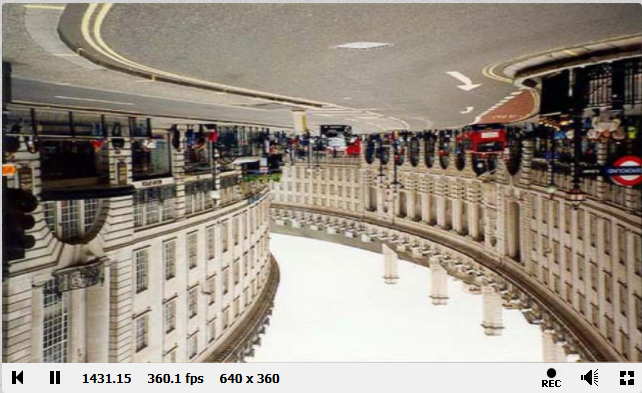

# HIT #3 - Copiar la imagen de entrada

En este primer caso se muestra la imagen/textura sin hacer ningun cambio. Tenemos una serie de variables a analizar:
- fragCoord: Son las coordenadas del píxel actual en la pantalla (en píxeles).
- iResoution: Es el tamaño total de la ventana (ancho y alto).
- Al dividir fragCoord.xy / iResolution.xy, llevamos las coordenadas a un rango de [0, 1], lo que se llama normalizar.
- Usamos esas coordenadas normalizadas para ir a buscar un color en la textura que elegimos (iChannel0) y simplemente lo copiamos tal cual.

```glsl
    void mainImage(out vec4 fragColor, in vec2 fragCoord) {
        vec2 uv = fragCoord.xy / iResolution.xy;
        fragColor = texture(iChannel0, uv);
    }
```



# HIT #4 - Voltear la imagen (hacer FLIP)

Acá la idea era darle una vuelta a lo que hicimos antes, invirtiendo la imagen:

## FLIPY - Poner la imagen cabeza abajo

```glsl
    void mainImage(out vec4 fragColor, in vec2 fragCoord) {
        vec2 uv = fragCoord.xy / iResolution.xy;
        uv.y = 1.0 - uv.y;  
        fragColor = texture(iChannel0, uv);
    }
```



En este caso la damos la vuelta verticalmente, para esto a cada coordenada Y le restamos su valor a 1. Eso hace que el píxel que estaba arriba ahora quede abajo, y viceversa.

## FLIPX - Espejar la imagen de lado

En este caso invertimos la coordenada x. El píxel que estaba a la izquierda, pasa a la derecha, y el de la derecha pasa a la izquierda. De esta forma hace un efecto de espejo.

```glsl
    void mainImage(out vec4 fragColor, in vec2 fragCoord) {
        vec2 uv = fragCoord.xy / iResolution.xy;
        uv.x = 1.0 - uv.x;  
        fragColor = texture(iChannel0, uv);
    }
```



## Voltear en ambos ejes

Si queremos hacer un giro total (dar vuelta tanto X como Y), podemos hacer:

```glsl
    void mainImage(out vec4 fragColor, in vec2 fragCoord) {
        vec2 uv = fragCoord.xy / iResolution.xy;
        uv = 1.0 - uv;  
        fragColor = texture(iChannel0, uv);
    }
```



Esto hace que la imagen se rote 180 grados, tanto en X como en Y.