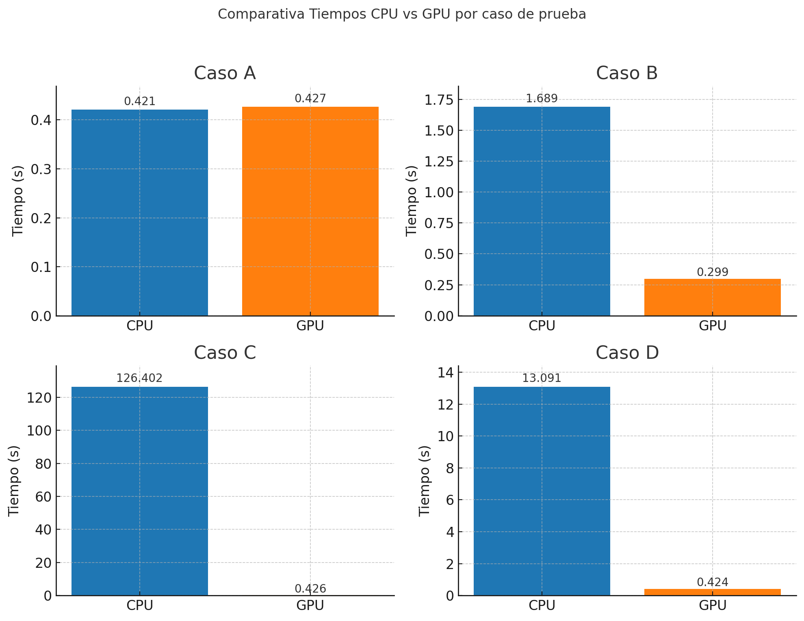
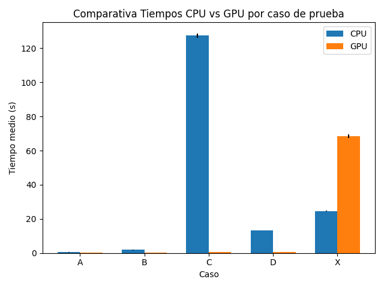

# Benchmark Hit #7: MD5 en CPU vs GPU

## Introducción
Este documento resume los resultados del benchmarking para el Hit #7, donde comparamos el rendimiento de la búsqueda por fuerza bruta de un hash MD5 entre una implementación en CPU y otra en GPU.

## Tabla comparativa

| Caso | Prefijo | Rango                  | Tiempo CPU (s) | Tiempo GPU (s) | Speedup (CPU/GPU) |
|------|---------|------------------------|----------------|----------------|-------------------|
| A    | `000`   | 0–100 000              | 0.421          | 0.427          | 0.98×             |
| B    | `0000`  | 0–1 000 000            | 1.689          | 0.299          | 5.64×             |
| C    | `00000` | 0–5 000 000            | 126.402        | 0.426          | 296.70×           |
| D    | `0000`  | 1 000 000–2 000 000    | 13.091         | 0.424          | 30.87×            |

## Gráfico de Tiempos CPU vs GPU



*El gráfico muestra los tiempos de ejecución en CPU y GPU para cada caso de prueba.*

## Repeticiones y Estadística

Para filtrar el jitter del sistema y obtener mediciones más robustas, se ejecutaron **5 repeticiones** de cada uno de los casos A–D y del test X (prefijo imposible `ffffff`) tanto en CPU como en GPU. Los resultados detallados se almacenaron en `results_detailed.csv` y luego se calcularon las estadísticas de media y desviación estándar, generando `results_summary.csv`.

### Resumen de estadísticas

| Caso | Prefijo | Rango               | CPU mean (s) | CPU std (s) | GPU mean (s) | GPU std (s) |
|------|---------|---------------------|--------------|-------------|--------------|-------------|
| A    | `000`   | 0–100 000           | 0.435        | 0.021       | 0.345        | 0.060       |
| B    | `0000`  | 0–1 000 000         | 1.853        | 0.069       | 0.302        | 0.006       |
| C    | `00000` | 0–5 000 000         | 127.430      | 1.267       | 0.444        | 0.005       |
| D    | `0000`  | 1 000 000–2 000 000 | 13.253       | 0.126       | 0.443        | 0.005       |
| X    | `ffffff`| 0–100 000           | 24.669       | 0.254       | 68.418       | 0.973       |

### Gráficos de estadística

- **Media y desviación estándar** por caso:

  

## Análisis de tiempos

- **Caso A**: Cargas pequeñas (< 100 k). La GPU (0.345 ± 0.060 s) es apenas más rápida que la CPU (0.435 ± 0.021 s), pero la variabilidad es mayor en GPU debido al overhead de lanzamiento.  
- **Caso B**: Con ~1 M pruebas, la GPU (0.302 ± 0.006 s) supera a la CPU (1.853 ± 0.069 s) con un speedup ~6× y muy baja dispersión en GPU.  
- **Caso C**: En rangos grandes (5 M), la GPU (0.444 ± 0.005 s) es casi 287× más rápida que la CPU (127.430 ± 1.267 s), mostrando la eficiencia masiva de la paralelización.  
- **Caso D**: Offset en el rango (1 M–2 M) no afecta: GPU (0.443 ± 0.005 s) vs CPU (13.253 ± 0.126 s), speedup ~30×.  
- **Caso X (no solución)**: Prefijo imposible. La GPU (68.418 ± 0.973 s) es mucho más lenta que la CPU (24.669 ± 0.254 s) porque no hay early exit y la GPU recorre todo el rango con alto overhead.

## Deploy

### Prerrequisitos

- **Windows 10/11 x64**  
- **Visual Studio 2019** con componente “Desarrollo de escritorio con C++”.  
- **CUDA Toolkit** (v11.8 o superior).  
- **PowerShell** (para ejecutar scripts).

### Estructura de carpetas

```
Benchmark/
│
├─ main.cu
├─ md5.cu
├─ md5.cuh
├─ main_cpu.cpp
├─ run_tests.ps1
├─ run_tests_stats.ps1
├─ generate_plots.py
├─ brute_range_gpu.exe      # Generado
├─ brute_range_cpu.exe      # Generado
├─ results_detailed.csv     # Tras repeticiones
├─ results_summary.csv      # Resumen estadístico
├─ summary_bar_chart.png    # Gráfico de barras con errorbars
├─ boxplot_times.png        # Boxplot de distribuciones
└─ output.png               # Gráfico inicial de tiempos
```

### Compilación

1. Abrir **x64 Native Tools Command Prompt for VS 2019** o ejecutar:
   ```cmd
   "C:\Program Files (x86)\Microsoft Visual Studio\2019\Community\VC\Auxiliary\Build\vcvarsall.bat" x64
   ```
2. Compilar GPU:
   ```cmd
   nvcc -arch=sm_75 -std=c++14 --compiler-bindir="C:\Program Files (x86)\Microsoft Visual Studio\2019\Community\VC\Tools\MSVC\14.29.30133\bin\Hostx64\x64" ^
     main.cu md5.cu -O3 -o brute_range_gpu.exe
   ```
3. Compilar CPU:
   ```cmd
   cl /EHsc /O2 main_cpu.cpp /link advapi32.lib /OUT:brute_range_cpu.exe
   ```

### Ejecución de tests

```powershell
Set-ExecutionPolicy -Scope Process -ExecutionPolicy Bypass
.
un_tests.ps1 -texto_base "TU_CADENA_BASE"
.
un_tests_stats.ps1 -texto_base "TU_CADENA_BASE" -reps 5
python generate_plots.py
```

Al finalizar, tendrás todos los CSVs y gráficos necesarios para tu informe.
