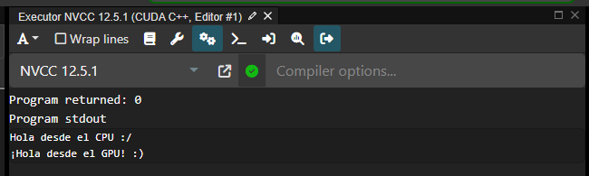

# Informe de tareas realizadas: Hola Mundo en CUDA

## ● Entorno utilizado

Para la ejecución del programa CUDA de “Hola Mundo” utilicé el sitio **Compiler Explorer** (https://godbolt.org/), un entorno online que permite compilar y ejecutar código en distintos lenguajes, incluyendo CUDA C++.

El entorno seleccionado fue:
- **Compilador:** NVCC 12.5.1
- **Lenguaje:** CUDA C++
- **Vista:** salida en ensamblador, salida del programa, y código PTX (ensamblador de GPU).

Esto permitió visualizar el código fuente, el código ensamblador generado y la salida de la consola, todo directamente en el navegador.

## ● Problemas encontrados y soluciones

El principal inconveniente fuera del entorno online fue al intentar instalar CUDA Toolkit en mi máquina local con una **NVIDIA GeForce 940MX**, que no es compatible con CUDA 12.9.
La solución fue identificar la versión máxima soportada por la GPU (CUDA 11.x) y planear descargar e instalar **CUDA Toolkit 11.8** con el instalador local offline, evitando el network installer que daba errores.

Por eso, mientras tanto, utilicé **godbolt.org** como entorno alternativo para pruebas y compilación online, lo que me permitió validar el código sin depender del hardware local.

## ● Setup utilizado

En el entorno online:
- **Navegador:** Chrome
- **Sistema operativo:** Windows 10
- **Sitio web:** godbolt.org
- **Compilador seleccionado:** NVCC 12.5.1

En el entorno local (planificado):
- **Sistema operativo:** Windows 10
- **IDE:** Visual Studio Code con extensiones de CUDA Toolkit
- **Compilador:** NVCC (CUDA Toolkit 11.8, pendiente de instalación)

## ● Hardware nativo (local)

La computadora utilizada tiene las siguientes características:
- **Notebook:** Acer Aspire E 15
- **GPU:** NVIDIA GeForce 940MX, Compute Capability 5.0
- **CPU:** Intel Core i5 7200U
- **Memoria RAM:** 16 GB
- **Sistema operativo:** Windows 10

Este hardware es capaz de correr CUDA hasta versión 11.x, pero no es compatible con versiones superiores como CUDA 12.x.

## ● Codigo utilizado

```cpp

    #include <stdio.h>

    __global__ void helloFromGPU() {
        printf("¡Hola desde el GPU! :)\n");
    }

    int main() {
        printf("Hola desde el CPU :/ \n");

        // Llamada al kernel con 1 bloque y 1 hilo
        helloFromGPU<<<1, 1>>>();

        // Esperar a que el GPU termine antes de salir
        cudaDeviceSynchronize();

        return 0;
    }

```

## ● Resultados obtenidos



## ● Conclusión

El entorno online de **godbolt.org** resultó útil para probar y depurar código CUDA sin necesidad de tener el toolkit instalado localmente.
Sin embargo, para ejecutar cargas reales en GPU local, es necesario instalar la versión compatible de CUDA Toolkit (11.8) y configurar correctamente Visual Studio Code junto al compilador `nvcc`.
